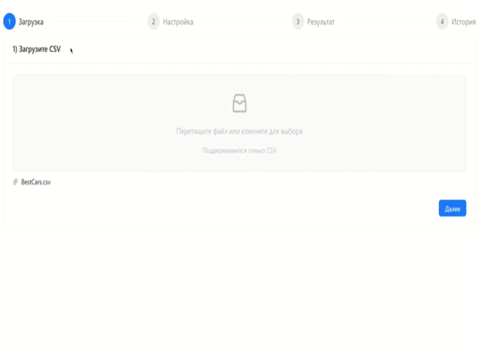

# Parselt

**Parselt** — это веб-приложение для интерактивной загрузки, анализа и обработки CSV-файлов с сохранением истории и логированием всех действий.  
Стек: **React (Ant Design) + ASP.NET Core + MS SQL + Docker**.

---

## Демонстрация

Ниже пример работы приложения (GIF-демо):



---

## Возможности

- **Загрузка CSV**  
  Поддержка файлов с любым разделителем (по умолчанию — запятая).

- **Просмотр структуры**  
  Отображение первых строк файла в табличном виде.

**Настройка правил разбора**

- Указание колонок, их имён и типов данных.
- Фильтрация по типу:

  - **Строка** — фильтр «содержит».
  - **Дата** — выбор диапазона.
  - **Decimal / Double** — выбор числового диапазона.
  - **Булевый** — выбор значения «Да» / «Нет».

**Обработка и сохранение**

  - Применение правил и отображение результата.
  - Логирование ошибок (например, при несоответствии количества значений).
  - Сохранение в базу данных.

**История загрузок**
  - Хранение информации о каждом файле.
  - Просмотр исходных данных, логов и результатов.
  - Возможность скачать данные или результат обработки.

---

## Стек

- **frontend/** — React + Ant Design (UI).
- **backend/** — ASP.NET Core (API, логика обработки).
- **MS SQL** — база данных для хранения файлов, логов и истории.
- **docker-compose.yml** — запуск всего приложения в контейнерах.

---

## Установка и запуск

Требуется установленный **Docker** и **Docker Compose**.

### Linux / macOS

```bash
git clone https://github.com/EgorFedosov/Parselt.git
cd Parselt
docker-compose up -d
```
